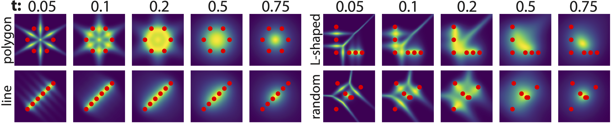
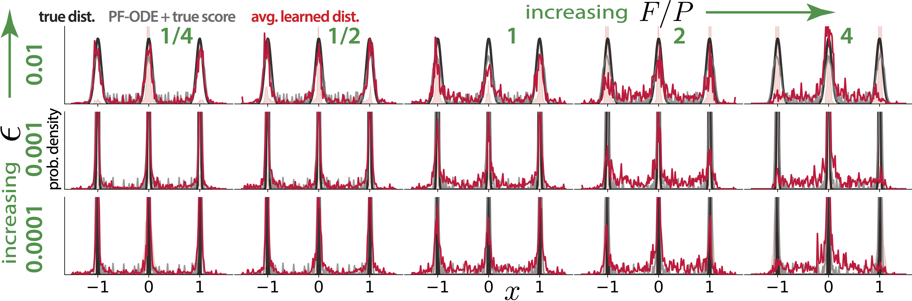
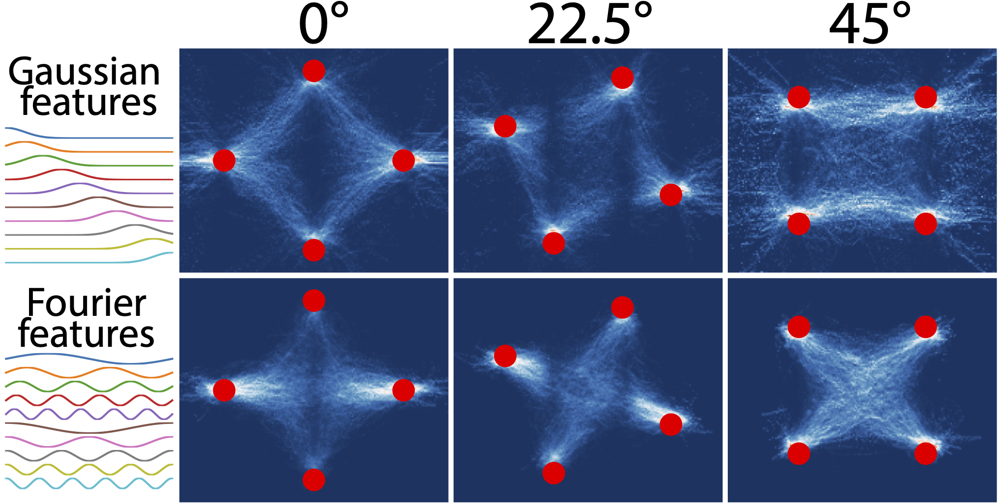

# Generalization through variance: how noise shapes inductive biases in diffusion models

This repo contains code that reproduces the figures from "[Generalization through variance: how noise shapes inductive biases in diffusion models](https://openreview.net/forum?id=7lUdo8Vuqa)", a paper accepted to ICLR 2025. The paper is mostly theoretical and the code involves only toy examples, so only standard Python libraries (NumPy, SciPy, and Matplotlib) are used.

There is one Jupyter notebook per figure:

**1.** `fig1-variance-visualize.ipynb` Contains code for generating Figure 1, "Visualization of proxy score variance ($\text{tr}(\mathbf{C})/[\text{tr}(\mathbf{C}) + \Vert \mathbf{s} \Vert_2^2]$) for four example 2D data distributions".

<p align="center">
</p>

**2.** `fig2-1d-generalize.ipynb` Contains code for generating Figure 2, "Average learned distribution ($N = 100$) for a linear model with Gaussian features trained on different sample draws from a 1D data distribution { -1, 0, 1 }".

<p align="center">
</p>

**3.** `fig3-2d-generalize.ipynb` Contains code for generating Figure 3, "Generalization of a 2D data distribution depends on features used and data orientation".

<p align="center">
</p>

## Citation 

```
@inproceedings{
    vastola2025generalization,
    title={Generalization through variance: how noise shapes inductive biases in diffusion models},
    author={John Vastola},
    booktitle={The Thirteenth International Conference on Learning Representations},
    year={2025},
    url={https://openreview.net/forum?id=7lUdo8Vuqa}
}
```
